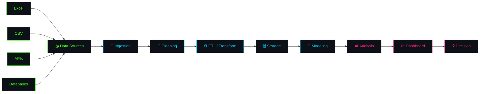

<div align="center">

```
 █████╗ ██████╗ ██╗   ██╗███╗   ██╗    ██████╗  █████╗ ███╗   ██╗██████╗ ██╗ █████╗ ███╗   ██╗
██╔══██╗██╔══██╗██║   ██║████╗  ██║    ██╔══██╗██╔══██╗████╗  ██║██╔══██╗██║██╔══██╗████╗  ██║
███████║██████╔╝██║   ██║██╔██╗ ██║    ██████╔╝███████║██╔██╗ ██║██║  ██║██║███████║██╔██╗ ██║
██╔══██║██╔══██╗██║   ██║██║╚██╗██║    ██╔═══╝ ██╔══██║██║╚██╗██║██║  ██║██║██╔══██║██║╚██╗██║
██║  ██║██║  ██║╚██████╔╝██║ ╚████║    ██║     ██║  ██║██║ ╚████║██████╔╝██║██║  ██║██║ ╚████║
╚═╝  ╚═╝╚═╝  ╚═╝ ╚═════╝ ╚═╝  ╚═══╝    ╚═╝     ╚═╝  ╚═╝╚═╝  ╚═══╝╚═════╝ ╚═╝╚═╝  ╚═╝╚═╝  ╚═══╝
```


<br/>


<br/><br/>

<a href="https://arunpandian.online"></a>
<a href="https://www.linkedin.com/in/arunpandianp-dataanalyst/"></a>
<a href="https://github.com/arun-pandian-p"></a>

</div>

<br/>

```diff
+ [BOOT] Loading identity module............ OK
+ [BOOT] Mounting skill matrix.............. OK
+ [BOOT] Establishing data pipelines........ OK
+ [BOOT] Calibrating dashboards............. OK
+ [BOOT] Linking external systems........... OK
! [READY] Arun Pandian — Data Intelligence Unit — awaiting query_
```

<br/>

## `◈` 00 — IDENTITY CORE

```yaml
┌─────────────────────────────────────────────────────────────────────┐
│  root@arun-pandian:~$ cat identity_core.yaml                        │
└─────────────────────────────────────────────────────────────────────┘
```

```yaml
designation:      Arun Pandian
class:            Data Analyst · Data Engineer · AI/Analytics Enthusiast
education:        B.Tech — Artificial Intelligence & Data Science
base_of_operations: Coimbatore, Tamil Nadu, India
prime_directive: >
  Transform raw, chaotic data into reliable pipelines,
  meaningful analytics, and confident business decisions.
operating_pipeline: >
  Raw Data → Clean → Transform (ETL) → Model → Analyze → Visualize → Decide
active_modules:
  - Advanced Data Analytics
  - Data Engineering @ Scale
  - Cloud Data Platforms (Snowflake)
  - AI-Powered Data Applications
  - Analytics Automation
threat_assessment: "Handles messy spreadsheets without flinching"
```

<br/>

## `◈` 01 — HUD OVERVIEW

<table>
<tr>
<td width="25%" align="center">

**`⬡ ANALYZE`**
<br/>
Python · Pandas · NumPy
<br/>EDA · Statistics
<br/>Data Cleaning

</td>
<td width="25%" align="center">

**`⬡ ENGINEER`**
<br/>
SQL · PostgreSQL · MySQL
<br/>ETL Pipelines
<br/>Data Modeling

</td>
<td width="25%" align="center">

**`⬡ VISUALIZE`**
<br/>
Power BI · DAX
<br/>Excel · Power Query
<br/>KPI Dashboards

</td>
<td width="25%" align="center">

**`⬡ AUTOMATE`**
<br/>
Workflow Automation
<br/>API Integration
<br/>AI-Augmented Analysis

</td>
</tr>
</table>

<br/>

## `◈` 02 — SKILL MATRIX

```yaml
┌─────────────────────────────────────────────────────────────────────┐
│  root@arun-pandian:~$ ./scan --target=skills --verbose              │
└─────────────────────────────────────────────────────────────────────┘
```

| `MODULE`        | `SIGNAL STRENGTH`             | `CLEARANCE`  |
|-----------------|--------------------------------|--------------|
| Excel           | ████████████████████░░ 90%     | `EXPERT`     |
| SQL             | ███████████████████░░░ 88%     | `ADVANCED`   |
| Python          | ██████████████████░░░░ 82%     | `ADVANCED`   |
| Power BI        | ██████████████████░░░░ 80%     | `ADVANCED`   |
| ETL / Pipelines | █████████████████░░░░░ 78%     | `PROFICIENT` |
| PostgreSQL      | █████████████████░░░░░ 75%     | `PROFICIENT` |
| Snowflake       | ███████████████░░░░░░░ 65%     | `GROWING`    |
| MLOps / AgentAI | ██████████████░░░░░░░░ 60%     | `GROWING`    |

<br/>

<div align="center">

</div>

<br/>

## `◈` 03 — DATA ARCHITECTURE PIPELINE



<br/>

## `◈` 04 — MISSION LOG (EXPERIENCE TIMELINE)

```text
[TIMELINE] ─────────────────────────────────────────────────────▶

  ● B.Tech — AI & Data Science
  │  Foundations in machine learning, statistics, and
  │  data-driven systems.
  │
  ▼
  ● Entry into Data Analytics
  │  SQL, Python, and Power BI became daily tools.
  │  Focus: dashboards, EDA, cleaning pipelines.
  │
  ▼
  ● Data Engineering Expansion
  │  ETL pipelines, PostgreSQL, Snowflake exploration.
  │  Focus: reliable, scalable data flows.
  │
  ▼
  ● Current Mission
  │  Building AI-augmented analytics tools and
  │  freelance-ready data solutions.
  │
  ▼
  ● [ NEXT ] Advanced cloud data engineering + MLOps
```

<br/>

## `◈` 05 — DEPLOYED PROJECTS

<table>
<tr>
<td width="50%" valign="top">

```
┌──────────────────────────────────┐
│ 📧 EMAIL-SUMMARIZER.exe          │
│ STATUS: DEPLOYED                 │
└──────────────────────────────────┘
```
AI-powered app that condenses long email threads into concise, actionable summaries.

`AI` `NLP` `Automation` `Python`

[`→ ACCESS_REPO`](https://github.com/arun-pandian-p/Email-summarizer)

</td>
<td width="50%" valign="top">

```
┌──────────────────────────────────┐
│ 🧠 XAI-SEIZURE-DASHBOARD.exe     │
│ STATUS: DEPLOYED                 │
└──────────────────────────────────┘
```
Explainable-AI dashboard for seizure prediction with model interpretability.

`ML` `XAI` `Python` `Dataviz`

[`→ ACCESS_REPO`](https://github.com/arun-pandian-p/XAI-Seizure-predicion-dashboard)

</td>
</tr>
<tr>
<td width="50%" valign="top">

```
┌──────────────────────────────────┐
│ 📈 PROJECT-ANALYTICS.exe         │
│ STATUS: DEPLOYED                 │
└──────────────────────────────────┘
```
Analytics workspace for tracking, monitoring, and visualizing project KPIs.

`Analytics` `KPI` `Dataviz`

[`→ ACCESS_REPO`](https://github.com/arun-pandian-p/Project_Analystics)

</td>
<td width="50%" valign="top">

```
┌──────────────────────────────────┐
│ 💰 SALARY-DASHBOARD.exe          │
│ STATUS: DEPLOYED                 │
└──────────────────────────────────┘
```
Interactive dashboard for exploring salary trends and compensation data.

`Analytics` `Dashboard` `Insights`

[`→ ACCESS_REPO`](https://github.com/arun-pandian-p/Salary_Dashboard)

</td>
</tr>
</table>

<br/>

## `◈` 06 — DIAGNOSTICS / LIVE STATS

<div align="center">


</div>

<br/>

## `◈` 07 — CONTRIBUTION FEED

<div align="center">

</div>

> `NOTE:` the snake animation needs a one-time GitHub Action added to this repo — see setup note at the bottom.

<br/>

## `◈` 08 — SYSTEM FAQ

```text
> query: "what do you actually build?"
< reply: dashboards, ETL pipelines, and analytics tools that turn
         messy raw data into decisions people can act on.

> query: "preferred stack?"
< reply: Python + SQL for the heavy lifting, Power BI/Excel for
         the story, Snowflake/Postgres for where it all lives.

> query: "open to freelance / collab?"
< reply: affirmative — see uplink channel below.
```

<br/>

## `◈` 09 — UPLINK / CONTACT

```bash
root@arun-pandian:~$ curl -s connect.arunpandian.online --data "intent=collab"
```

<div align="center">

<a href="https://arunpandian.online"></a>
<a href="https://www.linkedin.com/in/arunpandianp-dataanalyst/"></a>
<a href="https://github.com/arun-pandian-p"></a>

</div>

<br/>

<div align="center">

```
> print("Turning raw data into decisions, one query at a time.")
```


<br/>


</div>
